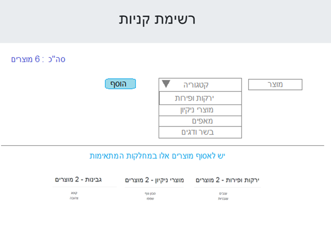

# 00-ShoppingList-React-Node-SQL

## installation

```
1) npm install
2) npm install (in server folder)
```

After that you need connect the database table from file products.sql (in phpMyAdmin for example)

## Usage:

```
 run scripts:
 npm run startClient ( from main folder )
 npm run startServer ( from server folder )

```

## דרישות


 

הקפדה על כתיבה מודרנית, מינימאליסטית, שימוש בטכניקות וביכולות מתקדמות של השפה.

ה CLIENT ייכתב ב REACT
צד שרת #C או NODE  :


(עדיפות ל .net core בגרסה 6, למי שמכיר)

אחסון הנתונים:
SqlServer , ElasticSearch Mongo , או שירות ענני דומה, שהפנייה אליו תהיה מצד השרת שמפותח במסגרת האפליקציה

רשימת Categories תאותחל מראש עם 5 ערכים, המוגדרים בבסיס הנתונים מראש :

-   מוצרי ניקיון
-   גבינות
-   ירקות ופירות
-   בשר ודגים
-   מאפים
    רכיב – "Total Items" - יציג את סך כול הפריטים בראש העמוד.
    רכיב זה ינוהל ב store כמו mobx , redux-toolkit או דומה. (סה"כ: XXX מוצרים בסל )

שדה טקסט חופשי :
להוספת מוצר (שם המוצר - בלבד) , ובחירת קטגוריה מתאימה, תוסיף אותו לרשימה המתאימה בתחתית העמוד, ובהתאמה ל Total Items
אם המוצר כבר קיים יתווסף לידו הכמות : חלב (3)

יש לצרף הוראות התקנה והרצה ברורות, מתוך GIT
עדיפות לפרויקט שיותקן בענן

## דרישת נוספות

עיצוב על ידי ספריית UI כמו BOOTSRAP material-UI, , ant design , תוך שמירה על Responsive Design , כך שיוצג היטב גם במובייל.

